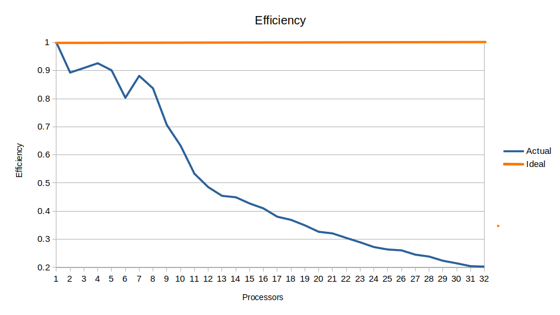

# MPI Parallel word count
## Introduction

This software performs word counting in parallel, thanks to MPI, over a large number of files.

- The **master** node (in this case the process with rank 0) reads the file list and distributes the files to all processes. Once a process has received its list of files, it starts to analyze it counting all the words, keeping track of the frequency of each word found. The structure holding the words and frequencies is called *local histogram*.

- In the second phase each process sends the local histogram to the master node.

- Once the **master** node received all local histograms it will merge them in a single structure called *global histogram*. After the global histogram is created, the master node will create a csv file with the global histogram saved.

## Implementation

Splitting the files between processes is bad choice because files could have different sizes, so the work won't be divided equally. A good solution is dividing the list bytes between processes, this way the workload will be the same. The master node will create a struct called ```files_info``` for each process, that has 5 parameters: 

1. ```size```
    - How many bytes the process must analyze in the given file list.
2. ```start```
    - First byte to be analyzed in the first file of the given list. A file can be splitted between more processes, this prevent that a process analyze the same bytes more than a single time.
3. ```end```
    - Last byte to be analyzed in the last file. A file can also be partially analyzed by a process.
4. ```num_files```
    - Number of files present in the list of files sent by the master node.
5. ```files```
    - List of file's indexes.

When a process receives, from the **master**, the structure ```files_info``` it will create a dictionary structure called ```dict``` (aka **local histogram**). When a process finds a new word it will be stored in the dictionary, if the entry is already present than a counter is increased, otherwise a new entry will be created with the counter set to 1. This structure is composed by the following parameters:

1. ```num_entries```
    - The number of entries stored in the dictionary.
2. ```size```
    - Entries that can be stored in the dictionary, if num_entries equals size than will be reallocated extra memory to allow more entries to be stored.
3. ```dict_entries```
    - List of entries, a entry is a structure that holds 2 parameters, a word and the occurrences of that word present in the file's list.

When a process has done its work it sends the dictionary (the **local histogram**) to the master. When the master receives all the dictionaries, it sorts and merges all the entries creating the **global histogram**, storing it in a file ```.csv``` (the name of the ```.csv``` will be asked to the user before creating the file).

The file ```word_counter.c``` is the core of the project, here are used some MPI features :

- ```MPI_Gather```
- ```MPI_Gatherv```
- ```MPI_Send```
- ```MPI_Recv```  

To send the custom structures towards other processes 3 *derived type*s were created using:

- ```MPI_Type_contiguous```
- ```MPI_Type_create_struct```

also from the line 111 to 227 there's the code to generate the ```files_info``` structures. Before sending the structure an extra check is done, the last byte saved in the ```end``` parameter will be used to check if some padding is needed (the ```end``` byte could be a letter in the middle of a word, if we don't do any padding the word will be split between 2 or more processes!). 

## Execution instructions

To compile the code use ```mpicc dict.c files_info.c utils.c word_counter.c main.c``` and to run it use ```mpirun -np <number_processes> <name_executable> <filename1, filename2, filename3, ...>```. Note that when using ```mpirun``` the program will ask for the name of the ```.csv``` file (max 20 characters, extra characters will be discarded) where the **global histogram** is going to be stored, the resulting file will be stored in the *result* directory. The files that need to be analyzed should be stored in the *texts* directory. To run the code on the cluster add ```-hostfile <hostfile>```, the public IPs of the nodes must be written in the file.

## Benchmarks

**Scalability** is defined as the ability to handle more work as the size of the computer or application grows. For software, **scalability** is referred to as parallelization efficiency, namely the actual *speedup* we obtain when using a certain number of processors. The speedup is defined as:

<p align="center">
    
</p>

Where **t(1)** is the computational time for the software running with one processor, and **t(N)** is the computational time running the same software with N processors.  
The *scalability testing* consists in two type of testing, **weak** and **strong** scalability. 

The cluster used for the benchmarks is an **Amazon AWS EC2** cluster composed by 4 instances of t2.2xlarge  (8 core processor each). 

### Strong scaling

The size of the problem remains constant, but the number of processors is increased, this will translate in reduced workload per processor. This test was made using 96 files **prova.txt**, each file is 40 kB of text, for a total of 4 mB.

This chart shows how long it takes to resolve the problem as the number of processors used in the computation increases.


This chart shows the speedup varies as the number of the processors involved in the computation increases. (The red line shows the ideal speedup, the blue line shows the actual speedup)


From the strong scalability tests we can conclude the best results are obtained with 18 processors. After that, the speedup starts declining. The decline can be attributed by the latency and limited bandwidth, the parallel part of the code isn't optimized correctly or the serial part of the code is acting as bottle neck. The first update that could be made, to improve the serial part, could be improving the sorting and merging part. 

### Weak Scalability

Both number of processors and the problem size are increased. This results in a costant workload per processor. This test was made using 3 files **prova.txt** per processor, each file is 40 kB, for a total of 120 kB per processor.

This chart shows how the time needed to resolve this problem changes with the increase of processors and problem size.


This chart shows the efficiency with the increase of the processors.



The ideal efficiency would remain 1, so using only a processor, but with the increase of processors the efficiency start to decline because more data needs to be communicated between nodes, plus another factor is the bandwidth of the communication network, latency and MPI overhead.